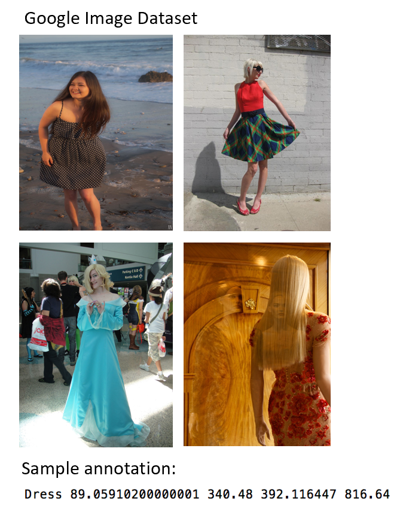

# Computer Vision Web Scraper

## Introduction
As known as traditional web scrapers, they do inspection of HTML source code of web pages, find the web elements containing specific information and store that part of desired information. While computer vision web scraper aims at specific classes (objects), uses trained object detection model to recognise those elements, interacts with webpages and scrap useful information with nearly no manforce.

In our use case, while for individual consumer or business, when searching a similar product, the traditional way is do word search in search engines, navigate over loads of information until we find similar ones. And the result is not garanteed, depending on the keywords as input. To solve this problem, the purpose of our project is to provide an alternative to product search for individuals (for consumption purpose) or businesses (for market benchmark purpose). As a POC (prove of concept), we choose dresses on e-commerce platforms to test if this functionality could improve user experience on product searching and search quality. 

In order to propose such service, we need to first build a database easily scalable and extendable to other objects. That is one of the main drivers why we tend to use computer web scraper for such task. Regarding training of the model, we used open source annotated images from Google, and dress detection was trained on 2 different models to determine the best fit one. Those models include classical CNN model FasterRCNN and more recent VGG-derived model Yolov3 (You Only Look Once). The comparaison of these 2 models was done after training, and they are later used to execute different tasks of the project since they have both their advantages and shortage.

## Methodology and Results:

#### Dataset for training

We use google open source dataset that comes with annotations. Those images have all various background noise and sometimes multiple target objects on single images. The sample annotation follows following format: object class, xmin of box, ymin of box, xmax of box and ymax of box. And this is usable only for FasterRCNN training. For Yolov3 training under [Darknet](https://github.com/AlexeyAB/darknet) framework, the annotations should be processed accordingly as written in the documentation of the repository.

This web scraper is an academic project containing 3 main parts:

* An object-detection model trained to detect dresses
* This object-detection model is used in scraping webpages each time it detects a dress, and fill a database with informations concerning the object detected (price, image, brand, etc.)
* Once the database filled, a neural network model is used and troncated at the last fully connected layer to act as a recommender. It takes an image as input, and outputs closest vector: the attributes of most similar image in our database (brand, price, etc.)

## Methodology:
###### Model training for detection:
  2 models involved: FasterRCNN with PyTorch and Yolov3
  * /FasterRCNN_training: trained with 30,000 images, within PyTorch under Google Colab env 
  * /Yolo3_training: trained with 17,000 images, under framework of Darknet under Google Colab env
  * Summary: FasterRCNN more accurate in terms of positive cases, but a lot slower to train

###### Scraping with detection model:
  * /WebScraper: 
  * Taking consideration the detection speed advantage of Yolov3 (22 milliseconds vs several seconds compared to FasterRCNN), the choice of model was made to Yolov3 for scraping part. The main website to build a database is zalando.fr and a dataset of 17,000 images was build thanks to the scraper_with_predict.py

###### Similarity research:
  * /WebScraper/similaritySearch was built with open source package faiss-cpu (since the project is not on the cloud for the moment, otherwise faiss-gpu will have computation capability advantage). 
  * with saved index and last layer long vectors, the search_index function finds k nearest neighbors in built dataset from our scrapped images.

###### Web application
  * /WebScraper/app.py
  * A simple web application was built with python Flask package, containing maining app.py and index.html, controling routes and views and displaying nearest neighbors
