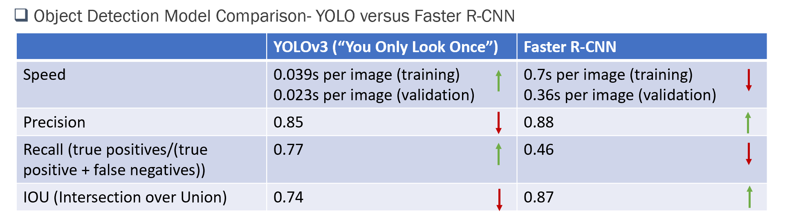
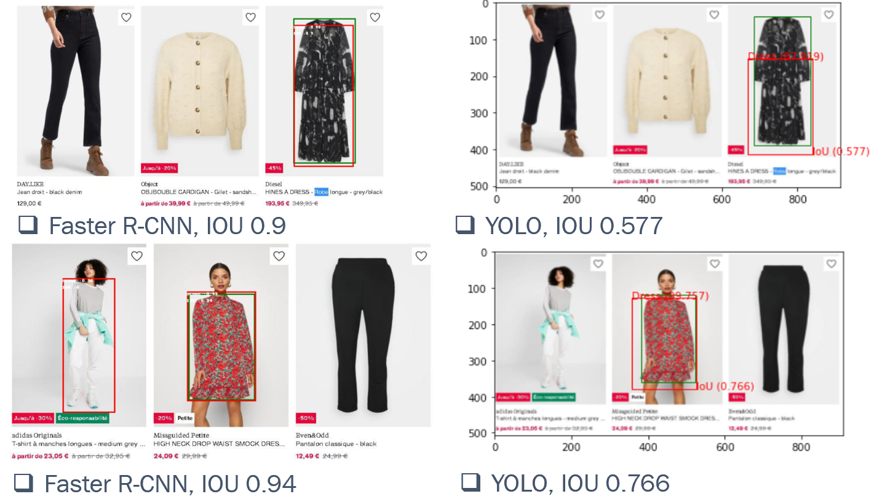

# Computer Vision Web Scraper

## Introduction
As known as traditional web scrapers, they do inspection of HTML source code of web pages, find the web elements containing specific information and store that part of desired information. While computer vision web scraper aims at specific classes (objects), uses trained object detection model to recognise those elements, interacts with webpages and scrap useful information with nearly no manforce.

In our use case, while for individual consumer or business, when searching a similar product, the traditional way is do word search in search engines, navigate over loads of information until we find similar ones. And the result is not garanteed, depending on the keywords as input. To solve this problem, the purpose of our project is to provide an alternative to product search for individuals (for consumption purpose) or businesses (for market benchmark purpose). As a POC (prove of concept), we choose dresses on e-commerce platforms to test if this functionality could improve user experience on product searching and search quality. 

In order to propose such service, we need to first build a database easily scalable and extendable to other objects. That is one of the main drivers why we tend to use computer web scraper for such task. Regarding training of the model, we used open source annotated images from Google, and dress detection was trained on 2 different models to determine the best fit one. Those models include classical CNN model FasterRCNN and more recent VGG-derived model Yolov3 (You Only Look Once). The comparaison of these 2 models was done after training, and they are later used to execute different tasks of the project since they have both their advantages and shortage.

## Methodology and Results:

#### Dataset for training

We use google open source dataset that comes with annotations. Those images have all various background noise and sometimes multiple target objects on single images. The sample annotation follows following format: object class, xmin of box, ymin of box, xmax of box and ymax of box. And this is usable only for FasterRCNN training. For Yolov3 training under [Darknet](https://github.com/AlexeyAB/darknet) framework, the annotations should be processed accordingly as written in the documentation of the repository.

#### Model training with Yolov3 and FasterRCNN
For dress detection we used the Yolov3 under Darknet architecture based on the Darknet53 ResNet. Yolo in general is fast in training and detection thanks to object localisation and classification processing simultanenously. In parallel, FasterRCNN is the fastest among the RCNN models (not comparable to Yolo though) and accurate in terms of prediciton. To be able to profit the best detection performance for scraping process, we process model training on both models at the same time. Limited by local machine CPU capacity, the training was executed on Google Colab notebooks to be able to use CUDA for GPU computing on same dataset of 30, 000 dress images. 

#### Comparaison of training results
In order to prepare the performance of 2 models, the main metric we used is IoU (Interception over Union), but we also take into account the average process time per image (in Google Colab environment). IoU shows the overlapping leve of predicted bounding box and annotations, while process time is a main concern for us in the upcoming scraping step and determines largely if the model is scalable and the difficulty to build a database with decent number of images. The comparaison could be found in the following table. 

From the recap table, we can observe a huge speed difference between FasterRCNN and Yolov3: Yolo is nearly 10 times faster in both training and prediction. While as imagined, FasterRCNN surpassed Yolov3 in precision but especially IoU. However, one remarkable phenomenum is that Yolov3 has better recall, meaning that FasterRCNN tends to make a lot more false negative errors.

The following figure shows some typical detection examples of the 2 models.

#### Conclusion and usage of models
From above metrics, it's obvious that both models have their strength and can thus compensate their shortage. 
* For scraper part, the precision and IoU are not determinant factor since we don't need the detection model to draw bounding boxes and need only that it tells if there is such object (dress). Meanwhile, speed is also important so that we can form a database much more quickly. Without hesitation, Yolov3 is the perfect model for this task and indeed it is applied in web scraping. 
* On the contrary, for similarity search part, we will need a detection model to tell which region of the user image contains searched object and to draw bounding box. In this case, a high IoU is preferable and the choice went easily to FasterRCNN. Likewise, for the similarity search model outputs proper results, the input images should also be process (cropped and remain only the bounding box region).

#### Similarity search with ResNet50 and Faiss
Architecture to find k closest neighbors

The cropped images were passed to python package ResNet50, one of the CNN models, to extract features. With Faiss, features vectors were indexed for each of the images in a numerical representation. As shown in the following dataframe, each image is presented as a horizontal vector of 2048 columns, and the database contains of 17,323 images. 

As input image is provided by user, the image will go through the same ResNet50 neural network model and returns a vector of the same length (2048x1). With the help of Faiss, this vector is going to compared to each single horizontal vector in the database such that we can find the closest one(s).

#### Web Application Interface
To have better visualisation of the test phrase of our model, a simple application was made to interact with user.

Technical keypoints:
* build with Python Flask as backend programing language
* frontend client with HTML routed by Flask
* application accessible from your browser following address: http://0.0.0.0:5000/

User journey:
* user goes to the web site
* select the image that he would like to find/compare/benchmark and submit to the app
* application returns 4 closest neighbors in our database
* application returns information (price/brand/etc.) concerning those items to user (feature to come very soon ...)

Have a look at our website!

